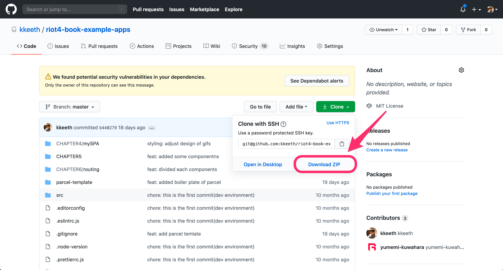

# Riot.jsで簡単Webアプリ開発

本リポジトリは、書籍「Riot.jsで簡単Webアプリ開発」の中で登場するソースコードをまとめたものになります。

書籍URL: https://www.amazon.co.jp/dp/B08BHMLZCJ/

ご利用の方は、[GitHub](https://github.com/kkeeth/riot4-book-example-apps) の画面右上にある `↓clone` というボタンをクリックしていただきますと以下のようなモーダルが表示され、右下の `Download ZIP` をクリックするとダウンロードできますので、ご確認ください。

(*ソースコードのダウンロード*)
