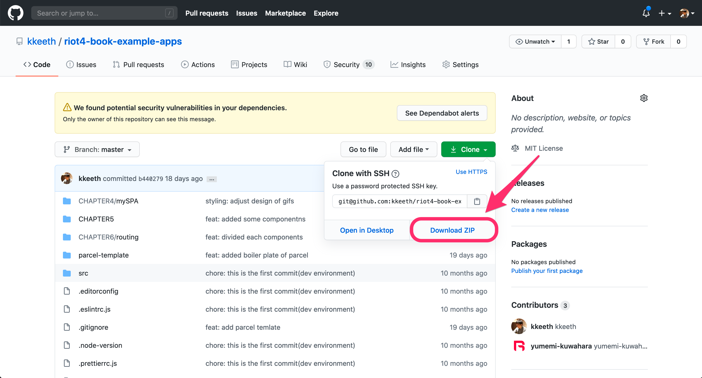

# Riot.jsで簡単Webアプリ開発

本リポジトリは、書籍「Riot.jsで簡単Webアプリ開発」の中で登場するソースコードをまとめたものになります。

書籍URL: https://www.amazon.co.jp/dp/B08BHMLZCJ/

> [!WARNING]
> **本リポジトリはメンテナンスを終了しています。**
>
> - 書籍は Riot.js v4 を対象としています。今後、依存パッケージの更新やバグ修正は行いません。
> - 依存パッケージ（Parcel v1 など）には**既知の脆弱性が含まれています**。サンプルコードは学習目的でローカル環境で動かすだけにとどめてください。本番環境での利用、公開サーバーへのデプロイ、開発サーバーの外部公開は行わないでください。
> - これから Riot.js を学ぶ場合は、[Riot.js 公式ドキュメント](https://riot.js.org/) で最新版の情報を参照してください。

## 書籍と同じ状態のソースコード

`main` ブランチは書籍の出版後に依存パッケージを更新しており、Riot.js のバージョン（v10 系）やパッケージマネージャー（pnpm）が書籍の内容と異なります。

書籍の内容と合わせて動かしたい場合は、書籍執筆当時（Riot.js v4 / Parcel v1 / Yarn）の状態を残した [`book-edition` タグ](https://github.com/kkeeth/riot4-book-example-apps/tree/book-edition) を利用してください。

## ダウンロード方法

[`book-edition` タグのページ](https://github.com/kkeeth/riot4-book-example-apps/tree/book-edition) の画面右上にある `↓Code` というボタンをクリックしていただきますと以下のようなモーダルが表示され、`Download ZIP` をクリックするとダウンロードできますので、ご確認ください。

(*ソースコードのダウンロード*)
